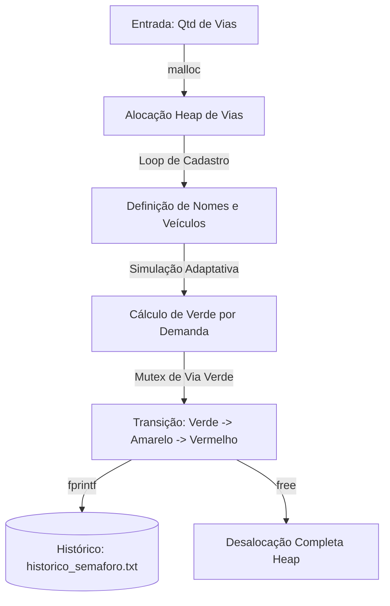

# 🚦 Semáforo Inteligente — Controle de Tráfego Adaptativo em C

> Simulação robusta de um controlador de tráfego inteligente estruturado em C puro, empregando alocação dinâmica de memória, gerenciamento estrito de recursos e persistência de dados.

---

## 📋 Visão Geral e Contexto de Engenharia

Este projeto simula o funcionamento de um **controlador eletrônico de trânsito em tempo real**, projetado nos moldes de drivers de baixo nível e sistemas operacionais de tempo real (RTOS). 

O sistema analisa o fluxo de veículos em múltiplas vias concorrentes e calcula dinamicamente a temporização do sinal verde de forma proporcional à demanda elástica de carros detectada em cada sensor, implementando um modelo de tomada de decisão adaptativa baseado em volumes.

---

## 🧠 Gerenciamento de Memória e Ciclo de Vida em C Puro

Por ser desenvolvido em C puro, o projeto foca intensamente nos aspectos fundamentais de controle de recursos e alocação dinâmica de memória de baixo nível. Ao contrário de linguagens modernas que utilizam Coletores de Lixo (Garbage Collectors) automatizados (como Java, Python ou C#), em C a gerência da memória física da pilha (*Heap*) é de **responsabilidade absoluta do programador**.

### 1. Alocação Dinâmica e Estruturas
* O firmware utiliza structs dinâmicos (`typedef struct Via`) e enums (`EstadoSemaforo`) para modelar as propriedades do trânsito.
* Em tempo de execução, a quantidade de vias é desconhecida e informada pelo usuário. O programa utiliza a função `malloc()` para reservar o espaço físico contíguo necessário no heap para armazenar o array de estruturas.

### 2. A Gravidade do *Memory Leak* (Vazamento de Memória)
* Em sistemas embarcados pequenos (como microcontroladores ou controladores industriais) que devem rodar de forma ininterrupta por meses ou anos, a perda de controle de blocos de memória é catastrófica.
* Se utilizarmos `malloc()` ou `calloc()` para reservar memória e esquecermos de chamar a função correspondente `free()` para liberar esse espaço, ocorre um **Memory Leak**. Os endereços de RAM permanecem bloqueados e inacessíveis, até que a memória física do sistema se esgote por completo, travando o hardware e interrompendo o serviço crítico.
* Este projeto aplica rigorosamente a boa prática de limpeza, garantindo que todo ponteiro alocado no início do programa seja varrido e desalocado via `free()` imediatamente antes da saída ou mudança de escopo.

---

## ⚙️ Lógica de Controle Adaptativo

O tempo de verde de cada via é calculado dinamicamente com base na quantidade de veículos detectados pelos sensores físicos:

| Quantidade de Carros Detectados | Tempo de Verde Calculado |
|---|---|
| `> 20 carros` (Tráfego Congestionado) | 30 segundos |
| `10 < carros ≤ 20` (Tráfego Moderado) | 20 segundos |
| `≤ 10 carros` (Tráfego Baixo) | 10 segundos |

* **Regra de Mutex de Tráfego:** Para evitar colisões de dados e de veículos, o código garante exclusividade física: apenas uma via por vez assume o estado lógico `VERDE` e as demais são mantidas em `VERMELHO`.

---

## 🏗️ Estrutura do Código e Abstração

O projeto é mantido sob uma arquitetura sequencial eficiente e enxuta:
* `main.c` — Código-fonte contendo a inicialização do array dinâmico de vias, a lógica de entrada/saída, o processamento de ciclos temporizados e a persistência em arquivos físicos do histórico de transição de sinais via ponteiros de arquivos.



---

## 🚀 Como Compilar e Executar

### 1. Compilar usando GCC
```bash
gcc main.c -o semaforo_inteligente
```

### 2. Executar a simulação
```bash
./semaforo_inteligente
```

O programa gerará o relatório de simulação diretamente em tempo real no console e persistirá as linhas cronológicas de log no arquivo `historico_semaforo.txt` local.
